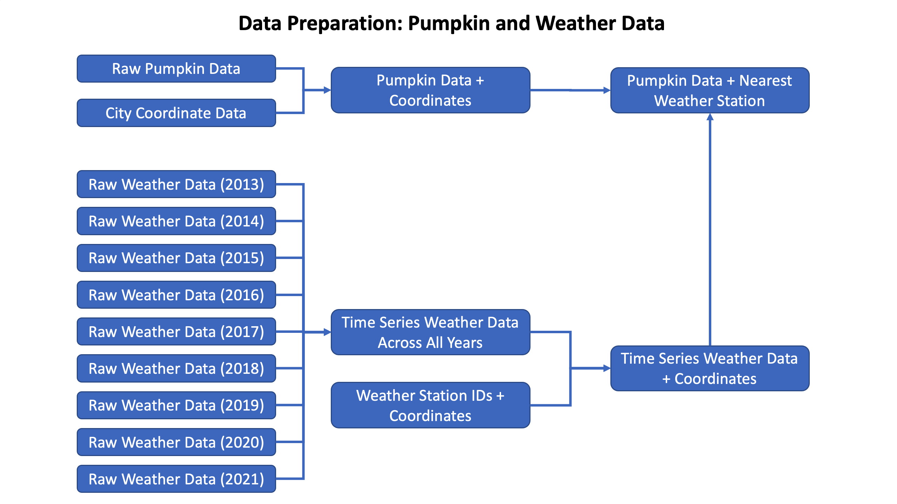

## 1. An Introduction

Giant Pumpkin competitions have grown in popularity over time and have evolved into a highly competitive sport among farmers with substantial cash prizes and even an organizing body called the [Great Pumpkin Commonwealth (GPC)](https://gpc1.org/) that establishes standards, eligibility requirements, and hosts regional competitions that enable qualification into an annual national championship. While giant pumpkins were the original and are the largest and most popular GPC category, other plant species from the Cucurbitaceae (“Cucurbit”) family can be entered which includes field pumpkins, squashes, gourds, and watermelons. A niche but passionate community of growers, researchers, and aficionados have developed novel seed genetics as well as cultivation techniques in order to maximize the harvest weight of this family of gourds, with [champion pumpkins frequently weighing in at over 2,000 lbs](https://abc7news.com/half-moon-bay-pumpkin-weigh-off-winner-biggest-2021-peninsula-patch/11112151/).

While there are many factors that a grower can control that contribute to the harvest weight of a pumpkin and other Cucurbits such as choice of seed genetics, cultivation method, and the skill of the grower, one of the most important factors in pumpkin plant growth and fruit production is environmental conditions such as temperature and precipitation. The goal of this research study is to investigate the impact of environmental factors on the weight of Cucurbits entered into official GPC competitions in the United States and determine whether certain climate conditions, and therefore geographic location, have an advantage over others when choosing where to grow a competitive giant pumpkin or Cucurbit.

Our research question is:

> **What impact do key environmental factors such as temperature and precipitation have on the weight of giant pumpkins and other Cucurbits grown in the United States that were entered into official GPC competitions?**

In order to answer this question, we evaluated all competitive entries in official GPC competitions from 2013 - 2021 and modeled the official competition weight of the pumpkin or Cucurbit as a function of the weather conditions it was grown under. Given weather is a complex system and pumpkins are grown over many months, we considered several different aggregated weather metrics such as maximum daily temperature, minimum daily temperature, amount of daily precipitation.

According to the [Penn State College of Agricultural Sciences](https://extension.psu.edu/pumpkin-production)

> *Pumpkins are very sensitive to cold temperatures (below 50°F) and plants and fruit will exhibit injury from even a slight frost. The best average temperature range for pumpkin production during the growing season is between 65 and 95°F; temperatures above 95°F or below 50°F slow growth and maturity of the crop. Pumpkins require a constant supply of available moisture during the growing season. Water deficiency or stress, especially during the blossom and fruit set periods, may cause blossoms and fruits to drop, resulting in reduced yields and smaller-sized fruits.*

Given this, we looked at maximum and minimum daily temperatures, their average and variability over the growing season, as well as metrics that track the frequency of extreme temperatures. We will also look at the amount of daily precipitation, its average and variability over the growing season.


## 2. A description of the Data and Research Design

### Pumpkin/Cucurbit Data

We obtained official GPC weights of pumpkins, tomatoes, squashes, and watermelons from the [Giant Pumpkins](https://github.com/rfordatascience/tidytuesday/tree/master/data/2021/2021-10-19) data set which was pulled from [www.bigpumpkins.com](www.bigpumpkins.com). This data set included the city and state it was grown in, the year of the competition, and the type of the Cucurbit (Giant Pumpkin, Field Pumpkin, Giant Squash, Giant Watermelon, or Tomato).

### City Coordinate Data:

City coordinate data was obtained from the [World Cities Database](https://www.kaggle.com/max-mind/world-cities-database) on Kaggle. This data was used to cross reference cities in the official GPC weight dataset and determine their latitude and longitude.

### Weather Data:

Weather data was obtained from [National Oceanographic and Atmospheric Association Climate Data](https://www.climate.gov/maps-data/dataset/daily-temperature-and-precipitation-reports-data-tables) which provided daily minimum temperature, daily maximum temperature, daily rainfall, and other climate data from weather stations across the United States. The coordinates of each pumpkin/Cucurbit was compared to the coordinates of all weather stations to determine its weather station. The relevant weather metrics were then aggregated over the relevant growing season for the relevant year and associated with that pumpkin/Cucurbit record.

### Dataset Preparation and Integration




``` {r install missing packages, echo = FALSE}
#install.packages("moments")
#install.packages("jtools")
```

```{r load packages, message = FALSE, echo = FALSE }
library(tidyverse)
library(ggplot2) 
library(sandwich)
library(stargazer)
library(lmtest)
library(dplyr)
library(readr)
library(car)
library(moments)
library(jtools)
```

```{r setup, include=FALSE, echo = FALSE }
knitr::opts_chunk$set(echo = TRUE)
```


```{r load data, echo = FALSE } 
d_pumpkin <- read.csv("pumpkin_consol.csv")
d_pumpkin <- d_pumpkin %>%
  filter(type !="Long Gourd") 
```


## 2a. A Model Building Process


Most data filtering is explained in above section 2. See below for EDAs, where key variables used in the model are plotted:

Pumpkin weights are evenly distributed looking at above histogram. There are bumps and these explain the even distribution for each type of pumpkin. 


```{r conduct EDA in this chunk for LHS pumpkin variables, echo = FALSE }
#summary(d_pumpkin$weight_lbs)


plot1 <- d_pumpkin %>%
  ggplot(aes(x=log(weight_lbs))) + 
  geom_histogram(bins=100) + 
  ggtitle("Distribution of Pumpkin Weight")
print(plot1)

#TODO: Add histgrams to Filter by type 


```

All weather related variables - Average Precipitation, Average Minimum Temperature, Average Maximum Temperature, minimum temperature standard deviation, maximum temperature standard deviation, precipitation standard deviation are evenly distributed.


```{r conduct EDA in this chunk for TMIN variables, echo = FALSE }

#summary(d_pumpkin$TMIN_AVG)
plot11 <- d_pumpkin %>%
  ggplot(aes(x=TMIN_AVG)) + 
  geom_histogram(bins=100) + 
  ggtitle("Distribution of avg min temperature")
print(plot11)

#summary(d_pumpkin$TMIN_STDEV)
plot12 <- d_pumpkin %>%
  ggplot(aes(x=TMIN_STDEV)) + 
  geom_histogram(bins=100) + 
  ggtitle("Distribution of stdev of min temp")
print(plot12)

```

``` {r conduct EDA in this chunk for TMAX variables, echo = FALSE }

#summary(d_pumpkin$TMAX_AVG)
plot13 <- d_pumpkin %>%
  ggplot(aes(x=TMAX_AVG)) + 
  geom_histogram(bins=100) + 
  ggtitle("Distribution of avg max temperature")
print(plot13)

#summary(d_pumpkin$TMAX_STDEV)
plot14 <- d_pumpkin %>%
  ggplot(aes(x=TMAX_STDEV)) + 
  geom_histogram(bins=100) + 
  ggtitle("Distribution of stdev max temperature")
print(plot14)

```


``` {r conduct EDA in this chunk for temp range variables, echo = FALSE }

#summary(d_pumpkin$TEMP_ABOVE_MIN)
plot17 <- d_pumpkin %>%
  ggplot(aes(x=TEMP_ABOVE_MIN)) + 
  geom_histogram(bins=100) + 
  ggtitle("Distribution of count of days per year above min temp")
print(plot17)

#summary(d_pumpkin$TEMP_BELOW_MAX)
plot18 <- d_pumpkin %>%
  ggplot(aes(x=TEMP_BELOW_MAX)) + 
  geom_histogram(bins=100) + 
  ggtitle("Distribution of count of days per year below max temp")
print(plot18)

```


After the initial data analysis, the conducted research attempted to prove the below model:
$$
  Weight = Average Precipitation + Average Minimum Temperature + Average Maximum Temperature 
$$ 

The output variable the team wanted to measure was the weight of the pumpkin, weight_lbs.

>A. We started with a model with only key variables, model1, where minimum temperature, maximum temperature, and precipitation was taken as the predictor. The R^2 value for this initial model was very low, ​​0.021.
>__model1: weight_lbs ~ TMIN_AVG+TMAX_AVG+PRCP_AVG __


>B. In order to improve the model, in model2, we’ve added the type as a covariate. The assumption here was that even though all pumpkin/tomatoes measured in this data set are in the same family, the type could impact the weight of the pumpkin. This increased the R^2 value to 0.460, but this was still not optimal.
>__model2: weight_lbs ~ MIN_AVG+TMAX_AVG+PRCP_AVG+type __

>C. In the next model, model3, we took a log transformation of the output variable. Taking the log transformation of the output variable drastically improved the linearity of the model with increased the R^2 value to 0.838.
>__model3: log transformation of weight_lbs ~ MIN_AVG+TMAX_AVG+PRCP_AVG+type __

>D. Adding on to this model, we’ve created a longer model, model4, by adding in weather-related variables, such as minimum temperature standard deviation, maximum temperature standard deviation, precipitation standard deviation, and year as a covariate. This resulted in R^2 value of 0.840.
>__model4: log transformation of weight_lbs ~ MIN_AVG+TMAX_AVG+PRCP_AVG+type+year+TMIN_STDEV+TMAX_STDEV+PRCP_STDEV__

>E. In the longest model, model5, we’ve added in variables like the number of days that exceeded the maximum temperature, and the minimum temperature. This concluded in the R^2 of 0.841.
>__model5: log transformation of weight_lbs ~ MIN_AVG+TMAX_AVG+PRCP_AVG+type+year+TMIN_STDEV+TMAX_STDEV+PRCP_STDEV+TEMP_BELOW_MAX + TEMP_ABOVE_MIN__

In the model, both type and the year as covariates greatly helped achieve our modeling goals, proven in the increased R^2 values. This explains that the same weather conditions could impact the size of the pumpkin differently depending on the year, and the variety of the pumpkin.


```{r fit a regression model here, echo = FALSE }
model1 <- lm(weight_lbs ~ TMIN_AVG+TMAX_AVG+PRCP_AVG , data=d_pumpkin)
model2 <- lm(weight_lbs ~ TMIN_AVG+TMAX_AVG+PRCP_AVG+factor(type) , data=d_pumpkin)
model3 <- lm(log(weight_lbs) ~ TMIN_AVG+TMAX_AVG+PRCP_AVG+factor(type) , data=d_pumpkin, na.action = na.exclude)
model4 <- lm(log(weight_lbs) ~ TMIN_AVG+TMAX_AVG+PRCP_AVG+factor(type)+factor(year)+TMIN_STDEV+TMAX_STDEV+PRCP_STDEV , data=d_pumpkin, na.action = na.exclude)
model5 <- lm(log(weight_lbs) ~  TMIN_AVG + TMAX_AVG + PRCP_AVG +factor(type)+factor(year)+ TMIN_STDEV + TMAX_STDEV + PRCP_STDEV + TEMP_BELOW_MAX + TEMP_ABOVE_MIN, data=d_pumpkin)


stargazer(
   model1, model2,
   type = 'text', 
   se = list(get_robust_se(model1),get_robust_se(model2))
)   


stargazer(
   model3, model4,model5,
   type = 'text', 
   se = list(get_robust_se(model3),get_robust_se(model4), model5)
)   

stargazer(
   model1, model3, model5,
   type = 'text', 
   se = list(get_robust_se(model1),get_robust_se(model3),get_robust_se(model5))
   )


```
Once the models are built, F-test was conducted to compare few models:


- Model 1 vs Model2 : p-value was lower than 0.05, which rejects the null hypothesis. This proves that the full model, model2 is a better model.
```{r code comparing models1, echo=FALSE}
anova(model1, model2, test="F")

```
- Model 3 vs Model 4: p-value was lower than 0.05, which rejects the null hypothesis. This proves that the full model, model4 is a better model.
```{r code comparing models2, echo=FALSE}
anova(model3, model4, test="F")

```
- Model 4 vs Model 5: p-value was lower than 0.05, which rejects the null hypothesis. This proves that the full model, model5 is a better model.
```{r code comparing models3, echo=FALSE}
anova(model4, model5, test="F")

```
This aligns with the R^2 value from above as well.


## 4. A Results Section

``` {r}
coeftest(model1, vcov=vcovHC(model1))
coeftest(model2, vcov=vcovHC(model2))
coeftest(model3, vcov=vcovHC(model3))
coeftest(model4, vcov=vcovHC(model4))
coeftest(model5, vcov=vcovHC(model5))
```


```{r code }
# model 1
model1_preds <- predict(model1)
model1_resids <- resid(model1)
# model 2
model2_preds <- predict(model2)
model2_resids <- resid(model2)
# model 3
model3_preds <- predict(model3)
model3_resids <- resid(model3)
# model 4
model4_preds <- predict(model4)
model4_resids <- resid(model4)

# model 5
model5_preds <- predict(model5)
model5_resids <- resid(model5)

plot1 <- ggplot(data=d_pumpkin, aes(model1_preds, model1_resids)) + geom_point() +
stat_smooth()
print(plot1)

plot2 <- ggplot(data=d_pumpkin, aes(model2_preds, model2_resids)) + geom_point() +
stat_smooth()
print(plot2)


plot3 <- ggplot(data=d_pumpkin, aes(model3_preds, model3_resids)) + geom_point() +
stat_smooth()
print(plot3)

plot4 <- ggplot(data=d_pumpkin, aes(model4_preds, model4_resids)) + geom_point() +
stat_smooth()
print(plot4)

plot5 <- ggplot(data=d_pumpkin, aes(model5_preds, model5_resids)) + geom_point() +
stat_smooth()
print(plot5)
```


```{r code and plots assessing normally distributed errors}
plot(model1$residuals)
plot(model2$residuals)
plot(model3$residuals)
plot(model4$residuals)
plot(model5$residuals)

# model 1
hist(residuals(model1))
boxplot(residuals(model1)) 
jarque.test(model1$residuals)
# model 2
hist(residuals(model2))
boxplot(residuals(model2)) 
jarque.test(model2$residuals)
plot(model2)

# model 3
hist(residuals(model3))
boxplot(residuals(model3)) 
jarque.test(model3$residuals)

# model 4
hist(residuals(model4))
boxplot(residuals(model4)) 
jarque.test(model4$residuals)
plot(model4)

# model 5
hist(residuals(model5))
boxplot(residuals(model5)) 
jarque.test(model5$residuals)
plot(model5)


#kurtosis(model$residuals)-3

#shapiro.test(model$residuals)
#bptest(log(mtcars$mpg)~mtcars$disp+mtcars$hp+mtcars$wt+mtcars$drat)


```

```{r code plotting residuals}
plot_errors_1 <- d_pumpkin %>% 
  ggplot(aes(x=model1_resids)) + 
  geom_histogram(bins=100) + 
  ggtitle("Distribution of Residuals Model1")
print(plot_errors_1)

plot_errors_2 <- d_pumpkin %>% 
  ggplot(aes(x=model2_resids)) + 
  geom_histogram(bins=100) + 
  ggtitle("Distribution of Residuals Model2")
print(plot_errors_2)
# TODO: Same error as aboe 'aesthetics must be either length 1 or the same...'
plot_errors_3 <- d_pumpkin %>% 
  ggplot(aes(x=model3_resids)) + 
  geom_histogram(bins=100) + 
  ggtitle("Distribution of Residuals Model3")
print(plot_errors_3)

plot_errors_4 <- d_pumpkin %>% 
  ggplot(aes(x=model4_resids)) + 
  geom_histogram(bins=100) + 
  ggtitle("Distribution of Residuals Model4")
print(plot_errors_4)

plot_errors_5 <- d_pumpkin %>% 
  ggplot(aes(x=model5_resids)) + 
  geom_histogram(bins=100) + 
  ggtitle("Distribution of Residuals Model5")
print(plot_errors_5)

qqplot_1 <- d_pumpkin %>% 
  ggplot(aes(sample=model1_resids)) + 
  stat_qq() + stat_qq_line() +
  ggtitle("QQPlot of Residuals Model1")
print(qqplot_1)

qqplot_2 <- d_pumpkin %>% 
  ggplot(aes(sample=model2_resids)) + 
  stat_qq() + stat_qq_line() +
  ggtitle("QQPlot of Residuals Model2")
print(qqplot_2)
# TODO: Same error as the above for model 3
qqplot_3 <- d_pumpkin %>% 
  ggplot(aes(sample=model3_resids)) + 
  stat_qq() + stat_qq_line() +
  ggtitle("QQPlot of Residuals Model3")
print(qqplot_3)

qqplot_4 <- d_pumpkin %>% 
  ggplot(aes(sample=model4_resids)) + 
  stat_qq() + stat_qq_line() +
  ggtitle("QQPlot of Residuals Model4")
print(qqplot_4)

qqplot_5 <- d_pumpkin %>% 
  ggplot(aes(sample=model5_resids)) + 
  stat_qq() + stat_qq_line() +
  ggtitle("QQPlot of Residuals Model5")
print(qqplot_5)

```


## 5. Limitations of your Model 

### 5a. Statistical limitations of your model


### 5b. Structural limitations of your model

There were many structural limitations to building a regression model with the combined dataset we chose. The first limitation was our lack of access to data around irrigation systems and amount of sunlight exposed to the Cucurbits. This is important as the net water intake during the growing season is a combination of precipitation and supplemental watering. The omitted variable regarding irrigation and other forms of watering created positive omitted variable bias by overemphasizing the estimation of the right hand variable - precipitation - with the outcome variable. Alongside supplemental watering, another opportunity for omitted variable bias comes from omitting the amount of sunlight the Cucurbits received. The variable has a causal relationship with our outcome variable and is correlated with the precipitation variable that we used in our regression. The sunlight variable was omitted due to lack of data and likely has a positive bias effect on the model further supporting the notion that the precipitation variable is overestimated in the model.

The omission of the supplemental watering and sunlight variables calls into question the core findings of the precipitation variable in the model. Since we can only measure precipitation in a region and not any sort of irrigation system setup by the grower, we are assuming that the precipitation is the only form of water the Cucurbits are receiving. This is likely a false assumption and therefore the omitted variable bias calls into question the explanatory power of the precipitation variable within the regression model. To resolve the missing data surrounding the omitted variable bias we could take two different approaches. We can collect the data from the growers about any supplemental water added and sunshine to Cucurbits on a time series basis. This would allow us to have a better understanding of the net water consumed by the Cucurbits and the amount of light they were exposed to. The second option would be to create proxy variables for the omitted variables which would call into question the reproducibility of the research.

The second limitation was missing data within our pumpkin data set. We omitted the seed_mother and pollinator_father variables from our model - though we believed they would be a deterement of the outcome variable - due to missing data. While research suggests seed_mother and pollinator_father have explanatory power of our outcome variable, omitting the variables does not create any bias in the model since the omitted variables do not have any correlation with the chosen independent variables. Other than the aforementioned variables, we omitted: grower_name, city, state_prov, country, gpc_site, ott (over the top inches), est_weight, pct_chart (weight percentile), and variety. These variables were omitted due to their lack of explanatory power of the outcome variable. We concluded that the omission of these variables did not create any omitted variable bias due to the lack of correlation between the listed variables and the independent variables chosen in the model.


## 7. Conclusion


## 8. References

> 1. The Great Pumpkin Commonwealth. 27 Oct. 2014, gpc1.org/.

> 2. “GPC Weighoff Results and Information.” Www.bigpumpkins.com, www.bigpumpkins.com/ViewArticle.asp?id=132.

> 3. GPC Rules and Handbook. Great Pumpkin Commonwealth, 1 Mar. 2021.

> 4. Daily Temperature and Precipitation Reports - Data Tables. National Oceanographic and Atmospheric Administration, www.climate.gov/maps-data/dataset/daily-temperature-and-precipitation-reports-data-tables.

> 5. “World Cities Database.” Kaggle.com, www.kaggle.com/max-mind/world-cities-database.

> 6. Penn State Extension. “Pumpkin Production.” Penn State Extension, 20 June 2005, extension.psu.edu/pumpkin-production.

> 7. KGO. “2,191-Pound Mega Gourd Wins World Championship Pumpkin Weigh-off in Half Moon Bay.” ABC7 San Francisco, 11 Oct. 2021, abc7news.com/half-moon-bay-pumpkin-weigh-off-winner-biggest-2021-peninsula-patch/11112151/. Accessed 9 Dec. 2021.

> 8. “How to Grow a Giant Pumpkin.” Www.pumpkinfest.org, www.pumpkinfest.org/giant-vegetables/how-to-grow-a-giant-pumpkin/.

> 9. Group, EMILY FABER, Sinclair Broadcast. “Growing These Massive One-Ton Pumpkins Takes a Green Thumb and the Perfect Seed.” WJLA, 29 Oct. 2020, wjla.com/news/offbeat/growing-these-massive-one-ton-pumpkins-takes-a-green-thumb-and-the-perfect-seed.

> 10. “Beginner’s Seminar Presentation.” Great Pumpkin Commonwealth, Great Pumpkin Commonwealth, gpc1.org/wp-content/uploads/2019/02/beginners-power-point.ppt.

